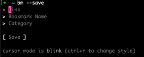
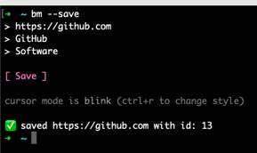
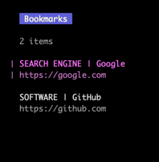
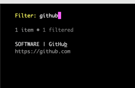

# bm

New version of the [bm.sh](https://github.com/gozeloglu/bm.sh) tool written in Go.

## Installation

You can type the following command.

```shell
go install github.com/gozeloglu/bm@latest
```

### Local development build

You can build and run the application with the following command. It can be used for local development tests.
```shell
go build bm.go &&  go install bm.go
```

## Usage

Currently, limited commands are provided.

### Save new bookmark

```shell
bm --save
```


After saving the link:



### List all bookmarks

```shell
bm
bm --list # this is another option for listing
```
You can navigate the links with up and down arrow keys.



Type `/` for searching a specific bookmarked link.



### Delete the bookmark

```shell
bm --delete
```

Just use **backspace** to delete.

### Version

```shell
bm --version
```